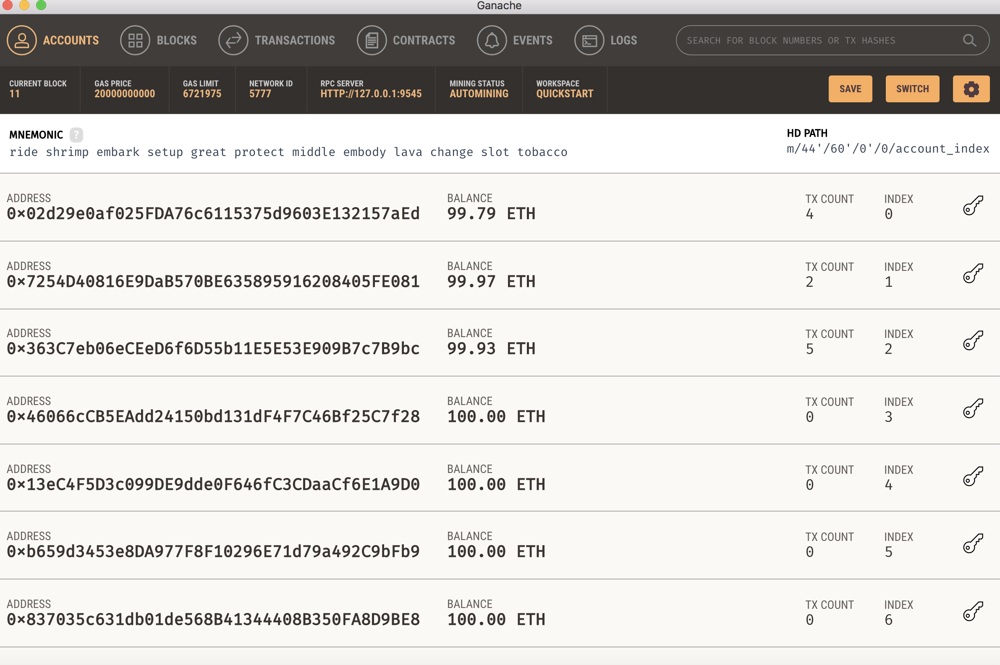
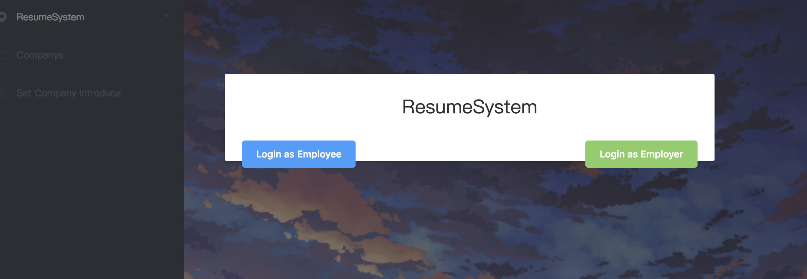
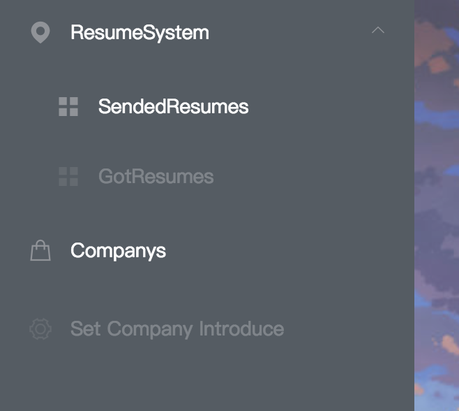
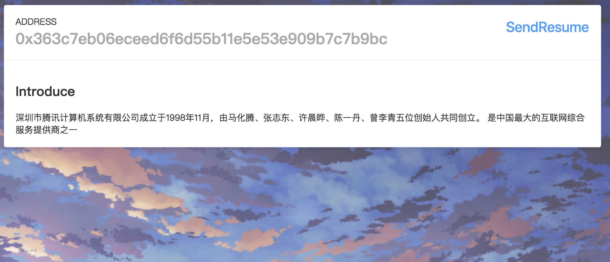
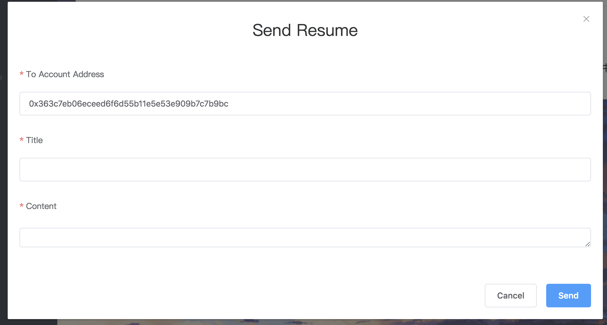
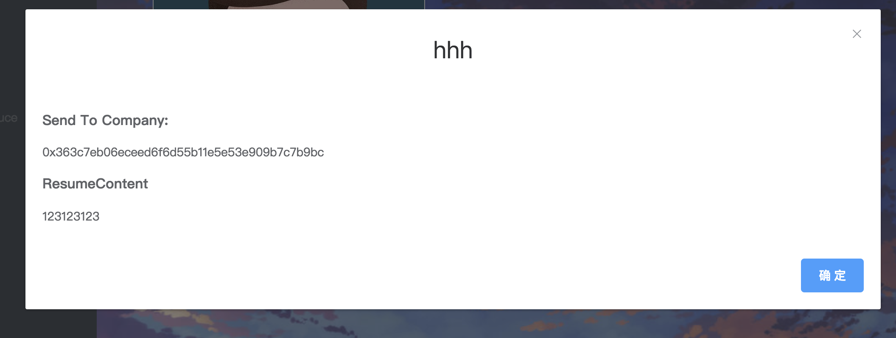
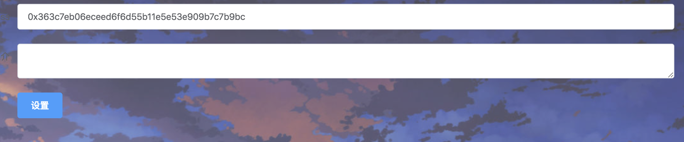
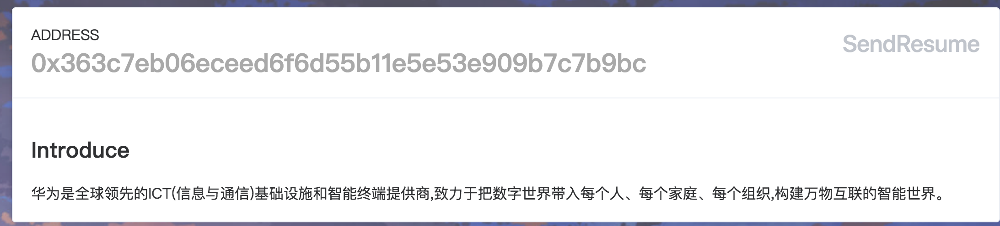

#实验报告
<!--一些基础知识：
Solidity在全局命名空间中预设了一些特殊的变量和函数，用来提供关于区块链的信息和一些通用的工具函数

block.blockhash(uint blockNumber) returns (bytes32)：指定区块的区块哈希——仅可用于最新的 256 个区块且不包括当前区块；而 blocks 从 0.4.22 版本开始已经不推荐使用，由 blockhash(uint blockNumber) 代替

block.coinbase (address): 挖出当前区块的矿工地址

block.difficulty (uint): 当前区块难度

block.gaslimit (uint): 当前区块 gas 限额

block.number (uint): 当前区块号

block.timestamp (uint): 自 unix epoch 起始当前区块以秒计的时间戳

gasleft() returns (uint256)：剩余的 gas

msg.data (bytes): 完整的 calldata

msg.gas (uint): 剩余 gas - 自 0.4.21 版本开始已经不推荐使用，由 gesleft() 
代替

msg.sender (address): 消息发送者（当前调用）

msg.sig (bytes4): calldata 的前 4 字节（也就是函数标识符）

msg.value (uint): 随消息发送的 wei 的数量

now (uint): 目前区块时间戳（block.timestamp）

tx.gasprice (uint): 交易的 gas 价格

tx.origin (address): 交易发起者（完全的调用链）-->

###参考博客：

[以太坊开发（二）Truffle示例项目拆解](https://www.jianshu.com/p/f2cae0b1ff45)

[【区块链】Truffle 部署 编译 测试 智能合约 的 完整实践操作](https://blog.csdn.net/diandianxiyu_geek/article/details/78361621)

###我的代码：
[https://github.com/PermanentKing/ResumeSystem](https://github.com/PermanentKing/ResumeSystem)


首先可以通过`truffle unbox`来下载框架，然后部署自己的合约，以及修改自己的网站，这里还有一个示例，叫`pet-shop`，已经有不错的ui界面，可以参照着模仿或者修改，但是我们选择使用`webpack`，于是输入`truffle unbox webpack`，下载并安装。

下载好之后，会有一个示例项目`MetaCoin`，然后只要修改前端，再将写好的合约放入对应的文件夹里即可。


在进行部署的时候，我使用了ganache来构建私链环境，有了UI界面的ganache更加直观方便了。
在项目文件夹输入：
```shell
truffle migrate --network ganache
```

然后通过以下命令部署服务器

```shell
npm run dev
```

然后发现报错，因为项目中用到了图片文件，需要对应的包：

```
npm install -save-dev url-loader和file-loader
```

然后还需要修改一下webpack的配置文件

修改webpack.config.js，添加png和jpg等文件的支持

```
 {
	test: /\.(gif|jpg|png|woff|svg|eot|ttf)\??.*$/,
	loader: 'url-loader?limit=8192&name=img/[name].[ext]'
 }
```

然后就可以运行了

按照第二篇博客的提示，还需要在浏览器安装一个叫`MetaMask`的插件，这样就可以连接到私链上，导入并管理以太币账户了。

首先在之前启用了ganache，并配置好端口


进入选择登录界面


以雇员的身份进入
   

功能菜单，其中部分是仅供雇员使用，部分仅供雇主使用。



选择Companys，可以得到雇主列表，选择，填写，并发送简历



填写简历



选择sendedresumes的菜单，可以看到自己发送出去的简历


点击详情可以看到全部内容



切换成雇主身份之后，可以看到所有投给你的简历：


然后可以在菜单栏选择更改公司简介：


修改后：



##合约接口
-----
####获取简历：

getResumeTitle

getResumeContent

getResumeOne

---
####创建账号：

createEmployee

createEmployer


-----

####设置/获取公司简介：

setEmployerIntro

getEmployerIntro

-----

####获取用户数量：

getEmployeeCount

getEmployerCount

----

####获取accout的address对应的用户：

getEmployeeIndex

getEmployerIndex

---

####获取对应index的用户的账户address：

getEmployeeAddress

getEmployerAddress

---

####获取对应用户的发送或接收的简历的数量：

getEmployeeSendResumeCounter

getEmployerGetResumeCounter

---

####获取对应用户的发送或接收的简历的索引：

getSendResumeAt

getGetResumeAt

-----


####加载简历
先getEmployeeIndex，然后getEmployeeSendResumeCounter，然后进行for循环，通过getSendResumeAt获取简历索引，通过getResumeTitle获取简历信息。


####加载雇主列表
基本同上，通过getEmployerAddress获取雇主地址，以及getEmployerIntro获取公司简介。


